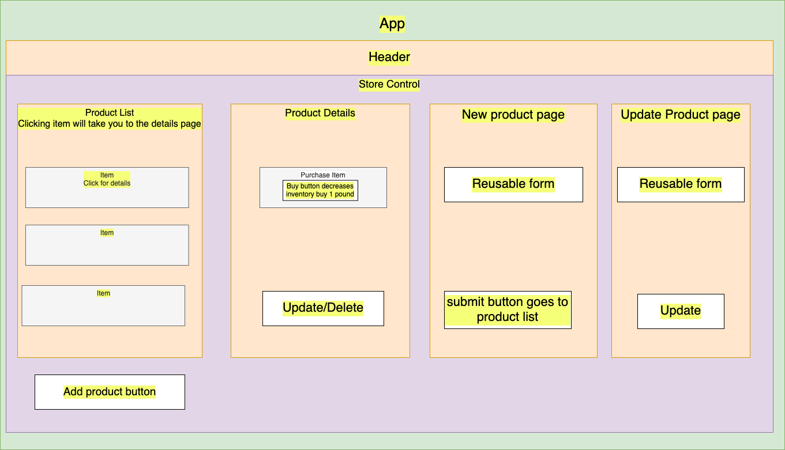

# Coffee Shop

### A React application built to track inventory of Coffee.
#### By _**Cameron Johnson**_

## Technologies Used
* _React_
* _Javascript_
* _HTML_
* _Markdown_

## Description
* An application to track the inventory of a coffee shop, it was constructed with the guidance of Epicodus.

## Setup/Installation
* _Go to https://github.com/Cameronjohnson30/Coffee-Shop.git_
* _Clone this repository to your local machine by running the following command_
* _git clone https://github.com/Cameronjohnson30/Coffee-Shop.git_
* _Navigate to root folder and open directory in your terminal_

#### Build Enviroment
* _Install Packages:_ npm install

#### Server:
* _Start Server:_ npm run start

##### The application should launch in your browser and if not
* _Open your browser and navigate to:_http://localhost:3000/

## Known Bugs
* _There are no known bugs at this time_

## License
This code utilizes a GPL License. If you have any issues/find bugs. Feel free to report them to me at here or contribute a fix to the code. Thanks! Copyright (c) 2022 Cameron Johnson

